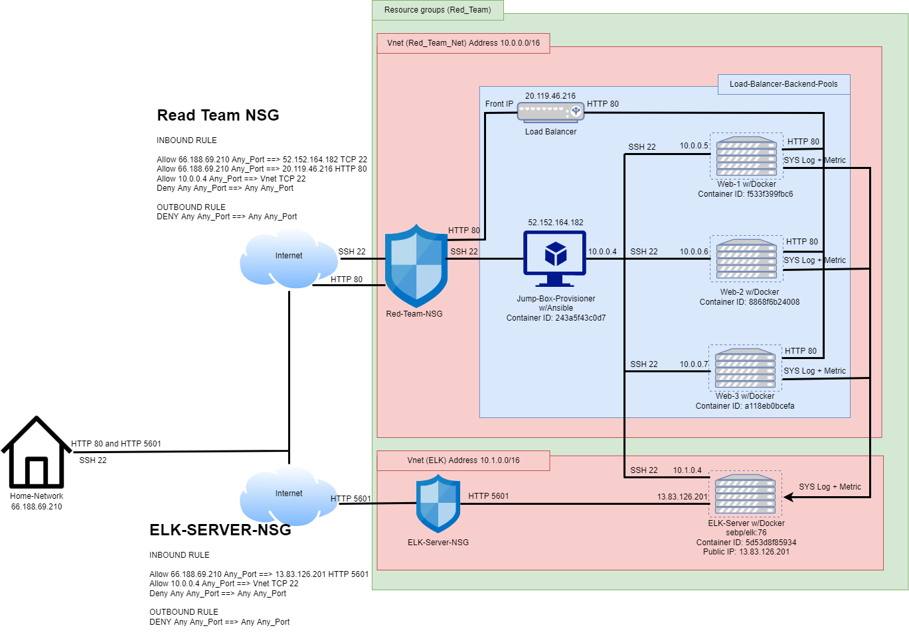

# Cyber-GT2021-2022-Project1

### Summary:
In this project, the files in this repository will be used to deploy the network below.

These files has been tested and deployed with the VM on Azure. They can be used to recreate the network above with the step by step below. 
These playbook-files (filebeat-playbook.yml, Install-elk.yml, metricbeat-playbook.yml, pentest-playbook.yml) can be used to deploy Container DVWA Application Web 1, 2, 3, Elk Server which including Metricbeat and Filebeat 

This document will contain the following 
1. The Topology 
2. Inbound/Outbound Rules 
3. Tutorial to Create Virtual-Machines, Virtual-Network, Network-Security-Group, Load-Balancer on Azure. 
4. Provisioing Ansible/Playbook to configure Elk Server, Web 1 2 3, Filebeat, and Metricbeat
+ Elk Server (will be receive logs monitor from Web 1, 2, 3)  
+ Metricbeat (will fetch metrics of Web 1, 2, 3 send to Elk server) 
+ Filebeat (will collect syslog form Web 1, 2, 3 send to ELK Server)

#### I. The Topology ####
The purpose of this project is to deploy DVWA (D*mn Vulnerable Web Application) expose to the world network using Load-Balancer as the simulator for training and education purpose. 

The Load-balancer 
+ Allow to access for anywhere on the network In order to collect data. 

The Jump-Box Provisioner inside network will acting as fast Provisioning/Delopment of DVWA as well as ELK server. 
+ The world network will not allow access this Jump-box Provisioner (Except Specific Allow IP)

Elk Server will allows users to easy monitor the vulnerbles of 3 Web DVWA. 
+ It will be installed with Metricbeat (fetch metrics of Web 1, 2, 3 traffic send to Elk server) and Filebeat (will collect syslog form Web 1, 2, 3 send to ELK Server)
+ The world network will not allow access this Jump-box Provisioner (Except Specific Allow IP)

Function: 

| Name         | Function   |Public IP     |Internal IP Address| Operating System|
|--------------|------------|--------------|-------------------|-----------------|
| Jump Box     |Gateway     |52.152.164.182|      10.0.0.4     | Linux           |
| Web 1,2,3    |Host DVWA   |No            |     10.0.0.5/6/7  | Linux           |
| Elk Server   |Monitor     |13.83.126.201 |      10.1.0.4     | Linux           |
| Load-Balancer|Gateway DVWA|20.119.45.216 |        NONE       | Linux           |

#### II. Inbound/Outbound Rules ####
+ Load-balancer and DVMA NSG(Network Security Group Rules) 

| Name          | Accessible | IP Addresses/Network            |Port        |
|---------------|------------|---------------------------------|------------|
| Jump Box      | Yes        | Home Public IP(66.188.69.210:22)|TCP 22(SSH) |
| Jump Box      | No         | ANY Outside IP                  |ANY         |
| Load-Balancer | Yes        | ANY                             |Any 80(HTTP)|
| 3-Web Machince| Yes        | Jump Box IP (10.0.0.4           |TCP 22(SSH) |

+ ELK NSG Rules

| Name          | Accessible | IP Addresses/Network            |Port        |
|---------------|------------|---------------------------------|------------|
| ELK Server    | Yes        | Home Public IP(66.188.69.210:22)|ANY 5601    |
| ELK Server    | Yes        | Jump Box IP (10.0.0.4           |TCP 22(SSH) |
| ELK Server    | NO         | ANY                             |ANY         |

#### III. Tutorial to provision Virtual-Machines, Virtual-Network, Network-Security-Group, Load-Balancer on Azure ####

##### 1. Resource Group #####
Azure Services ==> Resource Groups ==> Create
+ Name: Red_Team
+ Region: East US
+ Review + Create ==> Create

##### 2. Virtual Network #####

###### 2a. Virtual Network for DVWA and JUMP-BOX ######
Azure Services ==> Virtual Network ==> Create
+ Resourse Group: Red_Team
+ Name: Red_Team_Net
+ Region: East US 
+ IP Addresses: 10.0.0.0/16
+ Note: to avoid additional change Do NOT enable DDos Protection Plan
+ Review + Create ==> Create

###### 2b Virtual Network for ELK Server ######
Azure Services ==> Virtual Network ==> Create
+ Resourse Group: Red_Team
+ Name: ELK
+ Region: West US 
+ IP Addresses: 10.1.0.0/16
+ Note: to avoid additional change Do NOT enable DDos Protection Plan
+ Review + Create ==> Create

###### 2c Establish Connection between ELK and Red_Team_Net ######
Azure Services ==> Virtual Network ==> Elk ==> Peerings ==> +Add
+ This Virtual Network Peering link name: ELK-to-Red
+ Remote Virtual Network Peering link name: Red-To-Elk
+ Virtual Network: (Select) Red_Team_Net
+ Review + Create ==> Create

##### 3. Network-Security-Group #####

###### 1st Security Group for DVWA + Provisioner + Load-Balancer ######
Azure Services ==> Network Security Groups ==> Create
+ Resourse Group: Red_Team
+ Name: Red_Team_NSG
+ Region: East US
+ Using Inbound and outbound Rule Refer Section 2. 
+ Review + Create ==> Create

###### 2st Security Group for ELK-Server ######

Azure Services ==> Network Security Groups ==> Create
+ Resourse Group: Red_Team
+ Name: Elk-Server-NSG
+ Region: West US
+ Using Inbound and outbound Rule Refer Section II. 
+ Review + Create ==> Create

##### 4. Virtual Machine #####

###### 4a. GitBash + SSH Public Key on Local Machine ######
+ Intall Gitbash
(https://git-scm.com/downloads)
+ Open Gitbash to generate Public key on Local Machine
+ Run: ssh-keygen
+ (Hit ENTER key when gitbash asking "Enter file in which to save the key (/c/Users/Names/.ssh/id_rsa):")
+ (Input Password twice "sample:1234" when gitbash asking "Enter passphrase (empty for no passphrase):")
+ NOTE: remember Password it will be use to shh to Jump-box machine!

###### 4b Jumpbox-Virtual Machine ######
Azure Services ==> Virtual Machines ==> Create ==> Virtual Machine
+ Resourse Group: Red_Team
+ Virtual Machine Name: Jump-Box-Provisioner
+ Region: East US
+ Image: Ubuntu Server 20.04 LTS
+ Size: Standard B1s (1 vcpu, 1 GiB memory)
+ Authentication type: SSH public key
+ Username: azadmin
+ SSH public key source: Use existing public key
(Open Gitbash)
Run: cat ~/.ssh/id_rsa.pub

+ (Copy Local Machine Public Key) ==> SSH public Key

+ Networking 
+ Virtual Network: Red_Team_Net
+ Subnet 10.0.0.0/24
+ Public IP ==> Create New ==> Name: Jump-Box-IP and Select Static 

+ NIC Network Security Group: Advanced
+ Configure Network Security Group: Red_Team_NSG
+ Review + Create ==> Create

###### 4c Create Docker on Jump-box and obtain Docker's SSH public key ######
Azure Services ==> Virtual Machines ==> Select Jump-Box-Provisioner ==> Start 
Note: after create my Jump-Box-Provisioner VM I have Public IP 52.152.164.182 yours will be difference. 

+ Switch to GitBash
+ run: ssh azadmin@52.152.164.182
+ Enter password you create on Step 3d.1 
+ run: sudo apt update
+ run: sudo apt install docker.io
+ run: sudo systemctl start docker
+ run: sudo docker pull cyberxsecurity/ansible
+ run: sudo docker run -ti cyberxsecurity/ansible:latest bash

+ run: ssh-keygen
+ (Hit ENTER key when gitbash asking "Enter file in which to save the key (/c/Users/Names/.ssh/id_rsa):")
+ (Hit ENTER Twice when gitbash asking "Enter passphrase (empty for no passphrase):")
+ run: cat .ssh/id_rsa.pub
+ (Copy Docker Public Key) NOTE: This will be used to create the rest of Virtual Machine. 

###### 4d Create 3-Web DVWA VMs ######

WEB-1
Azure Services ==> Virtual Machines ==> Create ==> Virtual Machine
+ Resourse Group: Red_Team
+ Virtual Machine Name: Web-1
+ Region: East US
+ Avaibility Option: ==> Create New ==> Name: Web-Avaiblity ==> Ok
+ Image: Ubuntu Server 20.04 LTS
+ Size: Standard B1ms (1 vcpu, 2 GiB memory)
+ Authentication type: SSH public key
+ Username: sysadmin
+ SSH public key source: Use existing public key
+ (Copy Docker Public Key which obtain on 4c) ==> SSH public Key

+ Networking 
+ Virtual Network: Red_Team_Net
+ Subnet 10.0.0.0/24
+ Public IP: NONE!
+ NIC Network Security Group: Advanced
+ Configure Network Security Group: Red_Team_NSG
+ Review + Create ==> Create

NOTE: Repeat Steps From 4d WEB-1 to Create WEB-2 and WEB-3

###### 4f Create ELK-server VM ######
Azure Services ==> Virtual Machines ==> Create ==> Virtual Machine
+ Resourse Group: Red_Team
+ Virtual Machine Name: ELK-Server
+ Region: West US
+ Image: Ubuntu Server 20.04 LTS
+ Size: Standard D2s v3 (2 vcpus, 8 GiB memory)
+ Authentication type: SSH public key
+ Username: sysadmin
+ SSH public key source: Use existing public key
+ (Copy Docker Public Key which obtain on 4c) ==> SSH public Key

+ Networking 
+ Virtual Network: ELK
+ Subnet 10.1.0.0/24
+ Public IP ==> Create New ==> Name: ELK-Public-IP and Select Static 

+ NIC Network Security Group: Advanced
+ Configure Network Security Group: Elk-Server-NSG
+ Review + Create ==> Create

##### 5 Load-Balancer #####

###### 5a Create ELK-server VM ######
Azure Services ==> Load Balancers ==> Create
+ Resourse Group: Red_Team
+ Name: Red_Team_LB
+ Frontend IP Configuration ==> Add a Fronted IP Configuration 
+ Name: Red_Team_LB_Frontend_IP
+ Public IP Address ==> Create New ==> Name: Red_Team_LB_Frontend_IP Assignment: Statisc ==> OK ==> Add

+ Backend Pools ==> Add a Backend Pool 
+ Name: RedTeamBackendPool
+ Virtual Network: Red_Team_Net
+ Associated To: Virtual Machines
+ IP version: IPv4
+ Click Add ==> Select Web 1 2 3 ==> Add ==> Add 
+ Review + Create ==> Create

###### 5b Load-Balancing Rules ######
Azure Services ==> Load Balancer ==> Red_Team_LB ==> Load balancing rules ==> Add 
+ Name: LB_Rules
+ IP Version: IPv4
+ Frontend IP Address: Red_Team_LB_Frontend_IP (20.119.45.216)
+ Backend pool: RedTeamBackendPool
+ Protocol: TCP
+ Port: 80
+ Backend Port: 80 
+ Health Probe ==> Create New ==> Name: RedTeamHealthProbe Protocol: TCP Port: 80 ==> Ok 

+ click Add. 

