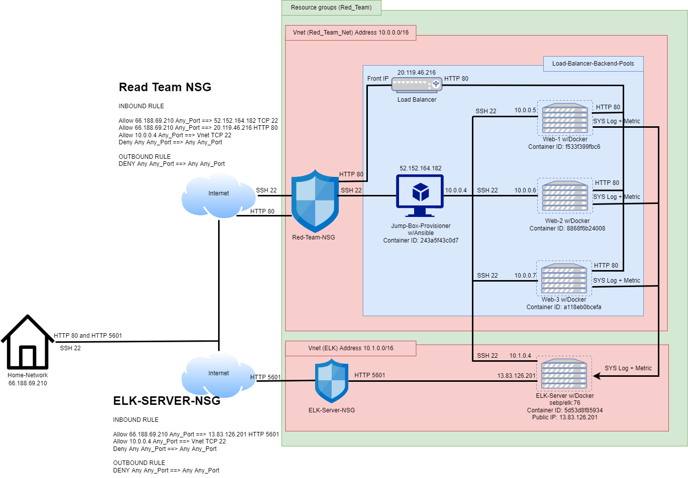

# Cyber-GT2021-2022-Project1

### Simulation:
by the request by XCrop's to deploy a cloud server in order for Red Team training new team Members. 
This will including ELK server to monitor activity of Webserver. 

### Requirement: 
1. Cloud Enviroment: Azure 
2. Home Machine Install: Gitbash or Linux Terminal

### Diagram: 

