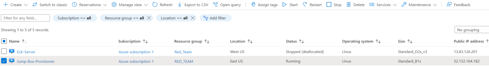
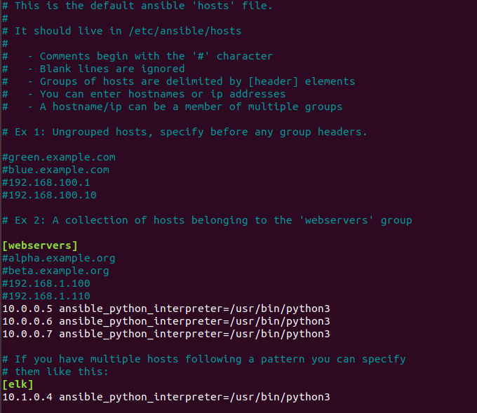

# Cyber-GT2021-2022-Project1

### Summary:
In this project, the files in this repository will be used to deploy the network below.

These files has been tested and deployed with the VM on Azure. They can be used to recreate the network above with the step by step below. 
These playbook-files (filebeat-playbook.yml, Install-elk.yml, metricbeat-playbook.yml, pentest-playbook.yml) can be used to deploy Container DVWA Application Web 1, 2, 3, Elk Server which including Metricbeat and Filebeat 

This document will contain the following 

I. The Topology 

II. Inbound/Outbound Rules 

III. Tutorial to Create Virtual-Machines, Virtual-Network, Network-Security-Group, Load-Balancer on Azure. 

IV. Configure Ansible/Playbook, Provisioing Elk Server, DVWA, Filebeat, and Metricbeat 
+ DVMA (the web host will be install on Web 1 2 3 VMs as well as using Load-Balancer as the Gateway) 
+ Elk Server (will be receive logs monitor from Web 1, 2, 3)  
+ Metricbeat (will fetch metrics of Web 1, 2, 3 send to Elk server) 
+ Filebeat (will collect syslog form Web 1, 2, 3 send to ELK Server)

#### I. The Topology ####
The purpose of this project is to deploy DVWA (D*mn Vulnerable Web Application) expose to the world network using Load-Balancer as the simulator for training and education purpose. 

The Load-balancer 
+ Allow to access for anywhere on the network In order to collect data. 

The Jump-Box Provisioner inside network will acting as fast Provisioning/Delopment of DVWA as well as ELK server. 
+ The world network will not allow access this Jump-box Provisioner (Except Specific Allow IP)

Elk Server will allows users to easy monitor the vulnerbles of 3 Web DVWA. 
+ It will be installed with Metricbeat (fetch metrics of Web 1, 2, 3 traffic send to Elk server) and Filebeat (will collect syslog form Web 1, 2, 3 send to ELK Server)
+ The world network will not allow access this Jump-box Provisioner (Except Specific Allow IP)

Function: 

| Name         | Function   |Public IP     |Internal IP Address| Operating System|
|--------------|------------|--------------|-------------------|-----------------|
| Jump Box     |Gateway     |52.152.164.182|      10.0.0.4     | Linux           |
| Web 1,2,3    |Host DVWA   |No            |     10.0.0.5/6/7  | Linux           |
| Elk Server   |Monitor     |13.83.126.201 |      10.1.0.4     | Linux           |
| Load-Balancer|Gateway DVWA|20.119.45.216 |        NONE       | Linux           |

#### II. Inbound/Outbound Rules ####
+ Load-balancer and DVMA NSG(Network Security Group Rules) 

| Name          | Accessible | IP Addresses/Network            |Port        |
|---------------|------------|---------------------------------|------------|
| Jump Box      | Yes        | Home Public IP(66.188.69.210:22)|TCP 22(SSH) |
| Jump Box      | No         | ANY Outside IP                  |ANY         |
| Load-Balancer | Yes        | ANY                             |Any 80(HTTP)|
| 3-Web Machince| Yes        | Jump Box IP (10.0.0.4)          |TCP 22(SSH) |

+ ELK NSG Rules

| Name          | Accessible | IP Addresses/Network            |Port        |
|---------------|------------|---------------------------------|------------|
| ELK Server    | Yes        | Home Public IP(66.188.69.210:22)|ANY 5601    |
| ELK Server    | Yes        | Jump Box IP (10.0.0.4)          |TCP 22(SSH) |
| ELK Server    | NO         | ANY                             |ANY         |

#### III. Tutorial to provision Virtual-Machines, Virtual-Network, Network-Security-Group, Load-Balancer on Azure ####

##### 1. Resource Group #####

Azure Services ==> Resource Groups ==> Create
+ Name: Red_Team
+ Region: East US
+ Review + Create ==> Create

##### 2. Virtual Network #####

###### 2a. Virtual Network for DVWA and JUMP-BOX ######
Azure Services ==> Virtual Network ==> Create
+ Resourse Group: Red_Team
+ Name: Red_Team_Net
+ Region: East US 
+ IP Addresses: 10.0.0.0/16
+ Note: to avoid additional change Do NOT enable DDos Protection Plan
+ Review + Create ==> Create

###### 2b Virtual Network for ELK Server ######
Azure Services ==> Virtual Network ==> Create
+ Resourse Group: Red_Team
+ Name: ELK
+ Region: West US 
+ IP Addresses: 10.1.0.0/16
+ Note: to avoid additional change Do NOT enable DDos Protection Plan
+ Review + Create ==> Create

###### 2c Establish Connection between ELK and Red_Team_Net ######
Azure Services ==> Virtual Network ==> Elk ==> Peerings ==> +Add
+ This Virtual Network Peering link name: ELK-to-Red
+ Remote Virtual Network Peering link name: Red-To-Elk
+ Virtual Network: (Select) Red_Team_Net
+ Review + Create ==> Create

##### 3. Network-Security-Group #####

###### 3a Security Group for DVWA + Provisioner + Load-Balancer ######
Azure Services ==> Network Security Groups ==> Create
+ Resourse Group: Red_Team
+ Name: Red_Team_NSG
+ Region: East US
+ Using Inbound and outbound Rule Refer Section 2. 
+ Review + Create ==> Create

###### 3b Security Group for ELK-Server ######

Azure Services ==> Network Security Groups ==> Create
+ Resourse Group: Red_Team
+ Name: Elk-Server-NSG
+ Region: West US
+ Using Inbound and outbound Rule Refer Section II. 
+ Review + Create ==> Create

##### 4. Virtual Machine #####

###### 4a. GitBash + SSH Public Key on Local Machine ######
+ Intall Gitbash
(https://git-scm.com/downloads)
+ Open Gitbash to generate Public key on Local Machine
+ Run: ssh-keygen
+ (Hit ENTER key when gitbash asking "Enter file in which to save the key (/c/Users/Names/.ssh/id_rsa):")
+ (Input Password twice "sample:1234" when gitbash asking "Enter passphrase (empty for no passphrase):")
+ NOTE: remember Password it will be use to shh to Jump-box machine!

###### 4b Jumpbox-Virtual Machine ######
Azure Services ==> Virtual Machines ==> Create ==> Virtual Machine
+ Resourse Group: Red_Team
+ Virtual Machine Name: Jump-Box-Provisioner
+ Region: East US
+ Image: Ubuntu Server 20.04 LTS
+ Size: Standard B1s (1 vcpu, 1 GiB memory)
+ Authentication type: SSH public key
+ Username: azadmin
+ SSH public key source: Use existing public key
(Open Gitbash)
Run: cat ~/.ssh/id_rsa.pub

+ (Copy Local Machine Public Key) ==> SSH public Key

+ Networking 
+ Virtual Network: Red_Team_Net
+ Subnet 10.0.0.0/24
+ Public IP ==> Create New ==> Name: Jump-Box-IP and Select Static 

+ NIC Network Security Group: Advanced
+ Configure Network Security Group: Red_Team_NSG
+ Review + Create ==> Create

###### 4c Create Docker on Jump-box and obtain Container's SSH public key ######
Azure Services ==> Virtual Machines ==> Select Jump-Box-Provisioner ==> Start 
Note: after create my Jump-Box-Provisioner VM I have Public IP 52.152.164.182 yours will be difference. 

+ Switch to GitBash
+ run: ssh azadmin@52.152.164.182
+ Enter password you create on Step 3d.1 
+ run: sudo apt update
+ run: sudo apt install docker.io
+ run: sudo systemctl start docker
+ run: sudo docker pull cyberxsecurity/ansible
+ run: sudo docker run -ti cyberxsecurity/ansible:latest bash

+ run: ssh-keygen
+ (Hit ENTER key when gitbash asking "Enter file in which to save the key (/c/Users/Names/.ssh/id_rsa):")
+ (Hit ENTER Twice when gitbash asking "Enter passphrase (empty for no passphrase):")
+ run: cat .ssh/id_rsa.pub
+ (Copy Docker Public Key) NOTE: This will be used to create the rest of Virtual Machine. 

###### 4d Create 3-Web DVWA VMs ######

WEB-1
Azure Services ==> Virtual Machines ==> Create ==> Virtual Machine
+ Resourse Group: Red_Team
+ Virtual Machine Name: Web-1
+ Region: East US
+ Avaibility Option: ==> Create New ==> Name: Web-Avaiblity ==> Ok
+ Image: Ubuntu Server 20.04 LTS
+ Size: Standard B1ms (1 vcpu, 2 GiB memory)
+ Authentication type: SSH public key
+ Username: sysadmin
+ SSH public key source: Use existing public key
+ (Copy Docker Public Key which obtain on 4c) ==> SSH public Key

+ Networking 
+ Virtual Network: Red_Team_Net
+ Subnet 10.0.0.0/24
+ Public IP: NONE!
+ NIC Network Security Group: Advanced
+ Configure Network Security Group: Red_Team_NSG
+ Review + Create ==> Create

NOTE: Repeat Steps From 4d WEB-1 to Create WEB-2 and WEB-3

###### 4f Create ELK-server VM ######
Azure Services ==> Virtual Machines ==> Create ==> Virtual Machine
+ Resourse Group: Red_Team
+ Virtual Machine Name: ELK-Server
+ Region: West US
+ Image: Ubuntu Server 20.04 LTS
+ Size: Standard D2s v3 (2 vcpus, 8 GiB memory)
+ Authentication type: SSH public key
+ Username: sysadmin
+ SSH public key source: Use existing public key
+ (Copy Docker Public Key which obtain on 4c) ==> SSH public Key

+ Networking 
+ Virtual Network: ELK
+ Subnet 10.1.0.0/24
+ Public IP ==> Create New ==> Name: ELK-Public-IP and Select Static 

+ NIC Network Security Group: Advanced
+ Configure Network Security Group: Elk-Server-NSG
+ Review + Create ==> Create

##### 5 Load-Balancer #####

###### 5a Create ELK-server VM ######
Azure Services ==> Load Balancers ==> Create
+ Resourse Group: Red_Team
+ Name: Red_Team_LB
+ Frontend IP Configuration ==> Add a Fronted IP Configuration 
+ Name: Red_Team_LB_Frontend_IP
+ Public IP Address ==> Create New ==> Name: Red_Team_LB_Frontend_IP Assignment: Statisc ==> OK ==> Add

+ Backend Pools ==> Add a Backend Pool 
+ Name: RedTeamBackendPool
+ Virtual Network: Red_Team_Net
+ Associated To: Virtual Machines
+ IP version: IPv4
+ Click Add ==> Select Web 1 2 3 ==> Add ==> Add 
+ Review + Create ==> Create

###### 5b Load-Balancing Rules ######
Azure Services ==> Load Balancer ==> Red_Team_LB ==> Load balancing rules ==> Add 
+ Name: LB_Rules
+ IP Version: IPv4
+ Frontend IP Address: Red_Team_LB_Frontend_IP (20.119.45.216)
+ Backend pool: RedTeamBackendPool
+ Protocol: TCP
+ Port: 80
+ Backend Port: 80 
+ Health Probe ==> Create New ==> Name: RedTeamHealthProbe Protocol: TCP Port: 80 ==> Ok 

+ Finsihed Add the Rule.  

#### IV. Configure Ansible/Playbook, Provisioing Elk Server, DVWA, Filebeat, and Metricbeat ####
+ This will Get done through GitBash through local machine SSH into Jump-box Public IP (Container Section III (4c)) 
+ The Rule already Allow Refer to Section II and Section III (3a) 

| Name          | Accessible | IP Addresses/Network            |Port        |
|---------------|------------|---------------------------------|------------|
| Jump Box      | Yes        | Home Public IP(66.188.69.210:22)|TCP 22(SSH) |
| 3-Web Machince| Yes        | Jump Box IP (10.0.0.4)          |TCP 22(SSH) |
| ELK Server    | Yes        | Jump Box IP (10.0.0.4)          |TCP 22(SSH) |

+ Open Gitbash
+ NOTE: Ensure all VMs is running on Azure. 

+ run: ssh azadmin@52.152.164.182
+ run: sudo docker container list -a #Checking the Container already install on Section III (4c)
+ run: docker start mc_multy #your Container Name might difference mine is mc_multy
+ run: docker attach mc_multy #your Container Name might difference mine is mc_multy
+ Note: The container has to be the exact same with the one has been used to create VMs SSH password (Section III (4c))

##### 5a. Ansible/Playbook for DVWA VMs #####

+ run: cd /etc/ansible/
+ run: nano pentest-playbook.yml
+ Note: Configuration details can be found on this link. 

[pentest-playbook](Ansible/pentest-playbook.yml.txt)

+ DVWA Playbook imange (This will be used to provisioning for Web 1 2 3 VMs)

+ SAVE: Hit Control + X then Y

##### 5b. Ansible/Playbook for DVWA Elk Server #####

+ run: nano install-elk.yml
+ Note: Configuration details can be found on this link. 

[install-elk](Ansible/Install-elk.yml.txt)

+ Elk Playbook imange (This will be used to provisioning for Elk)

+ SAVE: Hit Control + X then Y

##### 5c. Establish Connection between DVMA, Elk Server for fast deployment #####

+ Note: inside pentest-playbook.yml you will notice hosts: webservers and remote_user: sysadmin
+ Note: inside install-elk.yml you will notice hosts: elk and remote_user: sysadmin
+ Note: remote_user: sysadmin is matching with the User_ID that has been created on Section III (4d + 4f) 
+ Note: we will modify the hosts to connect with webservers, elk, and using USER Login sysadmin 

###### Setup link between hosts on Container + DVWA, ELK based on Based on internal IPs ######

+ run: nano /etc/ansible/hosts
+ Find: #[webservers] 
+ Delete # ==> [webservers] 
+ Add IPs: 10.0.0.5/6/7 ansible_python_interpreter=/usr/bin/python3 (Like picture below) 
+ Also Add [elk] 10.1.0.4 ansible_python_interpreter=/usr/bin/python3 (Like picture below)

+ SAVE: Hit Control + X then Y

###### Add Remote_user on Host File ######

+ run: nano /etc/ansible/ansible.cfg
+ Find: #remote_user = root 
+ Change to remote_user = sysadmin (Like picture below) 

+ SAVE: Hit Control + X then Y

##### 5d. Deployment DVWA/Elk Server #####

+ NOTE: After this we will have 2 play-book (pentest-playbook for DVWA web 1 2 3  VMs) , (install-elk for Elk VM) 

+ run: ansible-playbook pentest-playbook.yml # this might take 15s to 60s 
+ run: ansible-playbook install-elk.yml # this might take 15s to 60s

+ After the provisioning success We can test from local machine web-browser with the following rule already applied on Both NSG refer section III (3a + 3b) 

| Name          | Accessible | IP Addresses/Network            |Port        |
|---------------|------------|---------------------------------|------------|
| ELK Server    | Yes        | Home Public IP(66.188.69.210:22)|ANY 5601    |
| Load-Balancer | Yes        | ANY                             |Any 80(HTTP)|

+ OPEN: web-browser on your local machine
+ Enter on URL: 20.119.45.216/setup.php
+ This is your Public has been assigned by AZURE during Create Load-Balancer (section III (5a))

+ OPEN: web-browser on your local machine
+ Enter on URL: 13.83.126.201:5601/app/kibana#/home
+ This is your Public has been assigned by AZURE during Create Elk VMs (section III (4f))

##### 5e. Ansible/Playbook for Filebeat/Metricbeat #####
Note: At this point we still inside container. 

###### Download Metricbeat + Filebeat config file ######

+ run: cd /etc/ansible/
+ run: mkdir files/
+ run: cd files/
+ run: curl https://gist.githubusercontent.com/slape/5cc350109583af6cbe577bbcc0710c93/raw/eca603b72586fbe148c11f9c87bf96a63cb25760/Filebeat >> /etc/ansible/files/filebeat-config.yml # download filebeat config file. 
+ run: curl https://gist.githubusercontent.com/slape/58541585cc1886d2e26cd8be557ce04c/raw/0ce2c7e744c54513616966affb5e9d96f5e12f73/metricbeat >> /etc/ansible/files/metricbeat-config.yml # download metricbeat config file.

###### Edit Filebeat + Metricbeat config file ######

+ run: nano filebeat-config.yml
+ Search for output.elasticsearch 
+ Change the IP to your Elk Local IPs (mine is 10.1.0.4) 

+ Search for setup.kibana:
+ Change the IP to your Elk Local IPs (mine is 10.1.0.4) 

+ SAVE: Hit Control + X then Y

==> Made the exactly same change for Metricbeat. The metricbeat-config.yml will need to be change internal IP to 10.1.0.4

##### 5e. Create Playbook for Filebeat + Metricbeat ######

###### Filebeat.yml ######
+ Note: At this point we still inside container. 

+ run: cd /etc/ansible/
+ run: nano filebeat-playbook.yml 
+ Note: Configuration details can be found on this link. 

[filebeat-playbook](Ansible/filebeat-playbook.yml.txt)

+ Filebeat Playbook imange (This will be used to provisioning filebeat to Webservers)

+ SAVE: Hit Control + X then Y

###### Metricbeat.yml ######

+ run: cd /etc/ansible/
+ run: nano metricbeat-playbook.yml 
+ Note: Configuration details can be found on this link. 

[metricbeat-playbook](Ansible/metricbeat-playbook.yml.txt)

+ Metricbeat Playbook imange (This will be used to provisioning filebeat to Webservers)

+ SAVE: Hit Control + X then Y

##### 5f. Deployment Filebeat/Metricbeat on Elk Server ######

+ Note: At this point we still inside container. 

+ run: ansible-playbook filebeat-playbook.yml # this might take 15s to 60s
+ run: ansible-playbook metricbeat-playbook.yml # this might take 15s to 60s

+ After install playbook we can check on your local machine Browser. 
13.83.126.201:5601/app/kibana#/home ==> Add Log Data ==> System Logs ==> (Getting Started) DEB ==> (Scroll down Module Status) ==> Check data

